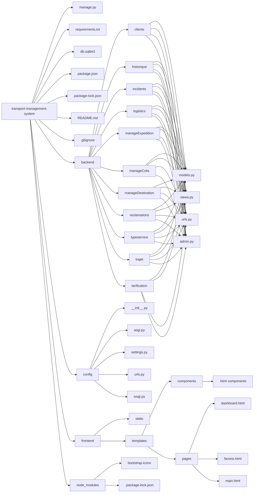
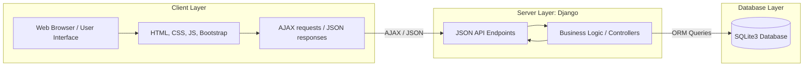
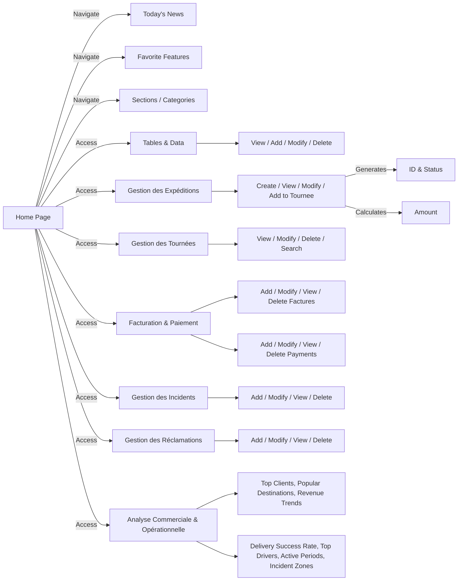

## Table of contents
- [Overview](#overview)
- [Project Structure](#project-structure)
- [Architecture and Design Choices](#architecture-and-design-choices)
- [Usage](#usage)
- [Tech stack](#tech-stack)
- [Setup & Run](#setup--run)

## Overview
This project is an information system for a transport and delivery company.  
It handles clients, expeditions, tours, billing, payments, and incidents.


## Project Structure



## Architecture and Design Choices
- MVC pattern (Model–View–Controller)
- Separation between business logic and presentation
- Centralized database access via Django ORM
### High level architecture diagram

### User Flow Diagram



## Usage

### 1. Access the Application

- Start the development server:
```bash
python manage.py runserver
```

- Open a browser and go to: `http://127.0.0.1:8000`

### 2. Navigate Modules

* **Clients:** view, add, edit, or delete client records.
* **Expeditions:** manage shipments, track statuses.
* **Tournee:** assign drivers and vehicles.
* **Billing & Payments:** manage invoices and payments.
* **Incidents & Reclamations:** log and track incidents or complaints.

### 3. Common Actions

* **Search:** look up specific records.
* **Filter:** refine data based on the NEW & OLD criteria. 
* **Pagination:** navigate through pages of records.

### 4. Data Management

* **Add New Record:** click “Add” buttons, fill in forms, submit.
* **Edit Record:** modify existing records via edit forms.
* **Delete Record:** remove records (with confirmation).
* **Export / Print:** download or print table data (if implemented).


## Tech stack
- **Backend:** Django (Python 3)  
- **Frontend:** HTML, CSS, JavaScript, Bootstrap  
- **Database:** SQLite3  
- **Dynamic interactions:** AJAX  
- **Conception :** Looping, Visual paradigm


## Setup & Run
1. Clone the repository:  
```bash
git clone <repo-url>
```
2. Install dependencies 
```bash
pip install -r requirements.txt
```
3. Apply migrations
```bash 
python manage.py migrate
```
4. Run the development server
```bash
python manage.py runserver
```
5. Access the project at : http://127.0.0.1:8000
## Team Members

- **Aissat Lyna**  
  Frontend & UI/UX design, interface implementation, backend linking

- **Boussaha Sara Alaa**  
  Data models, business logic, backend development, dashboard logic

- **Hachi Kawthar Khadidja**  
  Backend modules (Expeditions, Invoicing, Tours, Destinations, Incidents),
  data modeling (MCD, MLD), use cases, and documentation

