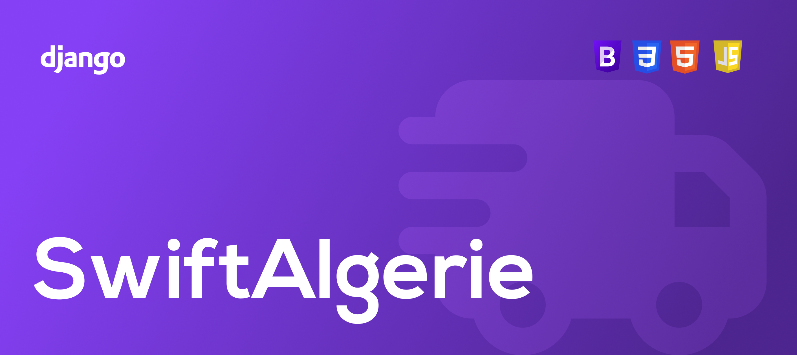
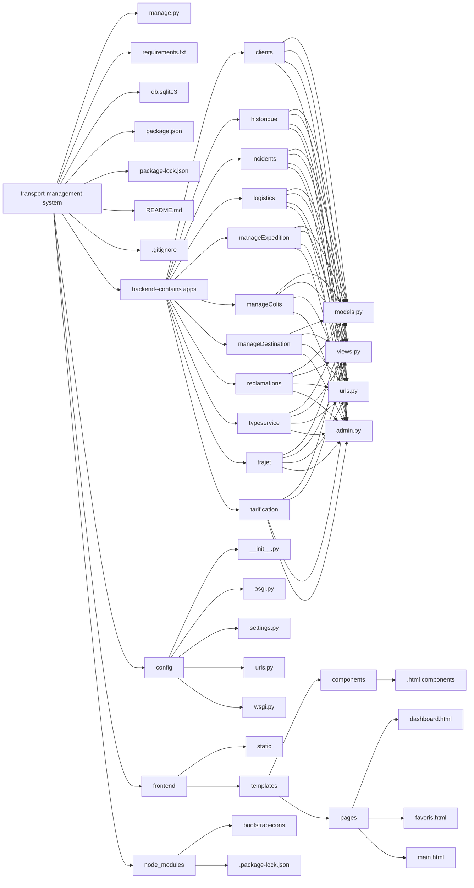
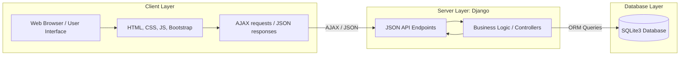
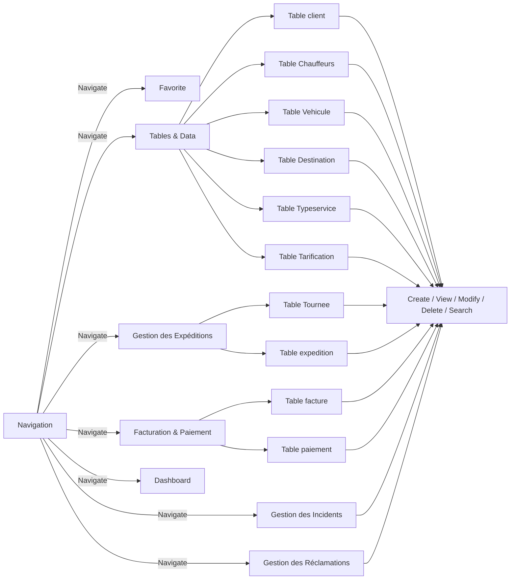

## Table of contents
- [Overview](#overview)
- [Project Structure](#project-structure)
- [Architecture and Design Choices](#architecture-and-design-choices)
- [Usage](#usage)
- [Tech stack](#tech-stack)
- [Setup & Run](#setup--run)

## Overview
This project is an information system for a transport and delivery company.  
It handles clients, expeditions, tours, billing, payments, and incidents.


## Project Structure



## Architecture and Design Choices
- MVC pattern (Model–View–Controller)
- Separation between business logic and presentation
- Centralized database access via Django ORM
### High level architecture diagram

### User Flow Diagram



## Usage

### 1. Access the Application

- Start the development server:
```bash
python manage.py runserver
```

- Open a browser and go to: `http://127.0.0.1:8000`

### 2. Navigate Modules

* **Clients:** view, add, edit, or delete client records.
* **Chauffeur & Vehicule:** view, add, edit, or delete logistics records.
* **Expeditions:** manage shipments, track statuses.
* **Tours:** assign drivers and vehicles.
* **Billing & Payments:** manage invoices and payments.
* **Incidents & Reclamations:** log and track incidents or complaints.

### 3. Module Overview

* **Clients:** manage client information (CRUD operations) and track account balances.
* **Expeditions:** register shipments with **automatically calculated costs** based on:

```
Montant total = Tarif de base + (Poids × Tarif poids) + (Volume × Tarif volume)
```

* **Tours:** assign shipments to drivers and vehicles, track delivery routes.
* **Billing & Payments:** generate invoices, calculate taxes, track partial/full payments, and update client balances automatically.
* **Incidents & Reclamations:** log issues and complaints, associate with shipments, and track resolution status.
* **Analysis & Reporting:** generate dashboards with  delivery success rates, top clients, top drivers, high-incident areas..

### 4. Common Actions

* **CRUD operations:** add, edit, delete records for all tables.
* **Search & Filter:** query shipments, clients, invoices, and incidents by any attribute (date, status, client, type of service).
* **Sort & Pagination:** organize large datasets efficiently.
* **JSON:** all backend responses are returned in JSON format, ready for frontend consumption.

*Example JSON response for a client:*

```json
    {
        "nom": "string",
        "prenom": "string",
        "telephone": "string",
        "email": "string",
        "solde": "number",
    }
```

### 4. Business Logic Highlights

* **Automatic cost calculation:** shipping costs consider weight, volume, service type, and destination.
* **Tracking & status updates:** shipment statuses evolve : *en transit → en centre de tri → en cours de livraison → livré / échec de livraison*.
* **Invoice & payment management:** partial payments update client balance; 
* **Route management:** tours group shipments, assign drivers/vehicles, and log route metrics (distance, fuel, incidents).

### 5. Developer Tips

* All modules follow the **Django MVC pattern**.
* Each app has `models.py`, `views.py`, `urls.py`, `admin.py`.
* API endpoints return **JSON** for frontend integration.
* Only one table/module example is shown; all other modules behave similarly.


## Tech stack
- **Backend:** Django (Python 3)  
- **Frontend:** HTML, CSS, JavaScript, Bootstrap  
- **Database:** SQLite3  
- **Dynamic interactions:** AJAX  
- **Conception :** Looping, Visual paradigm


## Setup & Run
1. Clone the repository:  
```bash
git clone <repo-url>
```
2. Install dependencies 
```bash
pip install -r requirements.txt
```
3. Apply migrations
```bash 
python manage.py migrate
```
4. Run the development server
```bash
python manage.py runserver
```
5. Access the project at : http://127.0.0.1:8000

